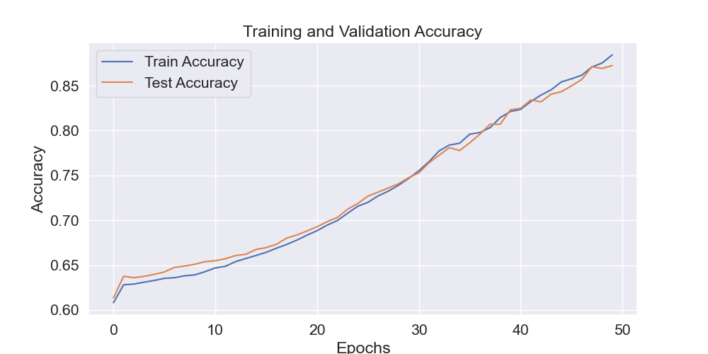
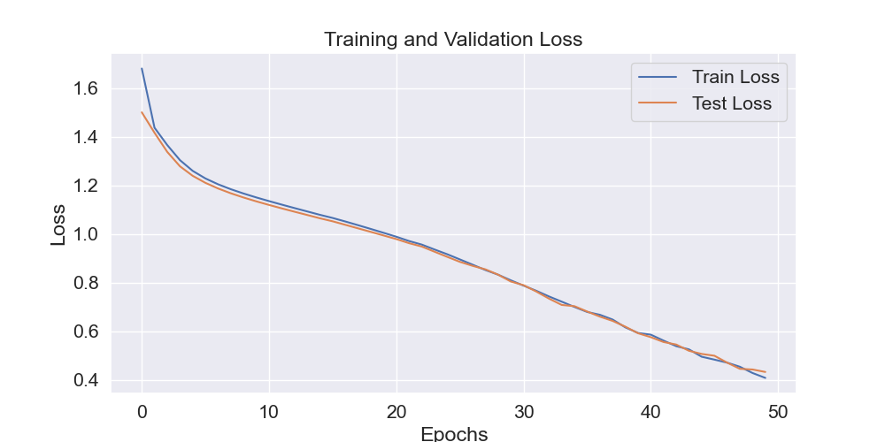

# Semantic Role Labelling For Hindi

## Semantic Role Labelling

Semantic Role Labelling, in natural language processing, is a process that assigns labels to different words in a sentence that indicate their **semantic role** in the sentence.
This helps in finding the meaning of the sentence, and more importantly, the role of a particlar word in creating that meaning of the sentence.
The task essentially boils down to identifying the various arguments associated with the _predicate_ or the main verb of the sentence and assigning them specific roles.

### Example
---

The above example has 3 distinct labels that can be seen - **Agent**, **Theme**, and the **Location**. It also has the predicate labelled. Using these labels we are then able to answer the question _"Who did what to whom where?"_

Some of the more common labels are -
- Agent
- Experiencer
- Theme
- Result
- Location

More labels (not exhaustive) can be found in these [slides](https://paperswithcode.com/media/thumbnails/task/task-0000000396-b5ac8e48.jpg)

### Problem Classification
---

The problem can the be further decomposed into the following -
> **Predicate Detection**: Findint the predicate in a given sentence.

> **Predicate Sense Disambiguation**: Disambiguating the sense of the predicate found.

> **Argument Identification**: Identifying the arguments for the given predicate for the given sense.
 
> **Argument Classification**: Assigning the labels to the arguments found.

### Hindi
---

For Semantic Role Labelling in Hindi, we will be labelling the words into the following roles:

| **Label**      | **Description**     |
| :---        |    :----  |
| ARG0      | Agent, Experiencer, or doer       |
| ARG1   | Patient or Theme        |
| ARG2      | Beneficiary       |
| ARG3   | Instrument        |
| ARG2-ATR      | Attribute or Quality       |
| ARG2-LOC   | Physical Location        |
| ARG2-GOL      | Goal       |
| ARG2-SOU   | Source        |
| ARGM-PRX      | Noun-Verb Construction        |
| ARGM-ADV   | Adverb        |
| ARGM-DIR      | Direction       |
| ARGM-EXT   | Extent or Comparision        |
| ARGM-MNR      | Manner       |
| ARGM-PRP   | Purpose        |
| ARGM-DIS      | Discourse       |
| ARGM-LOC   | Abstract Location        |
| ARGM-MNS      | Means       |
| ARGM-NEG   | Negation        |
| ARGM-TMP      | Time       |
| ARGM-CAU   | Cause or Reason        |

The following labels have been taken from this [paper](https://verbs.colorado.edu/hindiurdu/guidelines_docs/PBAnnotationGuidelines.pdf).

## Code Walkthrough

### Requirements 
torch==1.8.1. 
numpy==1.19.5. 
matplotlib==3.3.4. 
seaborn==0.11.1. 
pandas==1.1.5. 
scikit_learn==0.24.2.  

### Train a model  
Run following commands   
`cd src`  

#### 1. For logistic regression model
`python classifier_base.py`

#### 2. For Bidirectional LSTM model
`python SRL_NN_train.py --EMBEDDING_DIM=300 --NUM_HIDDEN_NODES=100 --epochs=50 --batchsize=64 --learning_rate=0.001`

### Hyperparameters 

The following table lists optimization/training hyperparameters for the neural LSTM based SRL model

|     Name      |Type          |Description       | Default value |       
|---------------|----------|------------------------|---|
| `learning_rate` | float | Initial learning rate.  | 0.001 |
| `EMBEDDING_DIM` | int | Dimensionality of the word vectors | 300 |
| `NUM_HIDDEN_NODES` | int | Number of hidden nodes of the neural model | 100 |
| `epochs` | int | Number of times datasets needs to be iterated for a model | 50 |
| `batchsize` | int | Size of a batch of training examples sampled from a dataset | 64 |

### Model Checkpoints/Trained models  
Our models are stored at 
models/srl_hindi_bilstm_50e.pth

### Results
Final Model - Bidirectional LSTM 

